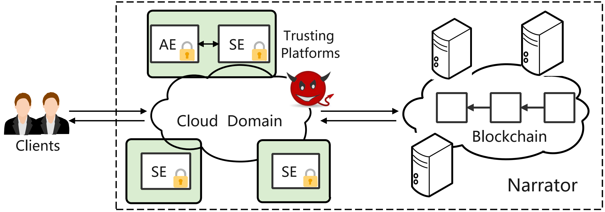

# Narrator: Secure and Practical State Continuity for Trusted Execution on Cloud
Thank you for your interest in Narrator. This document will get you started with our prototype implementation. If you have any problems, we will do our best to resolve them as soon as possible. 
Narrator is accepted by ACM CCS'22, see [list of accepted papers](https://www.sigsac.org/ccs/CCS2022/program/accepted-papers.html) for more details. You can download the paper [here]().


## Overview of Narrator

Narrator is a performant distributed system, which contains $n = 2f + 1$ State Enclaves (SEs) running on different SGX-enabled platforms. Each SE can provide state continuity service to all the Application Enclaves (AEs) on the same platform. To tolerate unexpected failures, Narrator adopts a customized version of the consistent broadcast protocol rather than complicated consensus protocols for state updates.

## WorkFlow of Narrator
### Directory Outline
- [aliyun.sh](./aliyun.sh) AliCloud Deployment Script of Narrator
- [init.sh](./init.sh) Initialization Script
- [AppEnclave](./AppEnclave) AppEnclave's Core Code
    - [common](./AppEnclave/common/) AppEnclave's basic communication protocols code include cryptographic algorithms and SGX attestation protocol
    - [host](./AppEnclave/host/) AppEnclave's function implementation code
        - [host/network](./AppEnclave/host/network) AppEnclave's communication channel realization code
- [ServerEnclave](./ServerEnclave) ServerEnclave's Core Code
    - [common](./ServerEnclave/common/) ServerEnclave's basic communication protocols code include cryptographic algorithms and SGX attestation protocol
    - [host](./ServerEnclave/host/) ServerEnclave's function implementation code
        - [host/network](./AppEnclave/host/network) ServerEnclave's communication channel realization code
- [tendermint-ansible](./tendermint-ansible) Tendermint Deployment Script

### System Initialization
In this procedure, we utilize [Tendermint](https://tendermint.com/) as a BFT-based blockchain platform interact with all SEs autonomously. There is only one legitimate group of n SEs with known identities running on n different SGX-enabled platforms.

The protocol flow figure is shown in [sys_init.png](./figure/sys_init.png), with the building process details as follows. 

```
Master SE ---------->  remote evidence ----------> Slave SE
Master SE <----------  remote evidence <---------- Slave SE
Master SE ---------->  AES pk and nonce ---------> Slave SE
Master SE <----------  AES        reply <--------- Slave SE
Master SE ---------->  Singed PKI certificate ---> Slave SE
Master SE <----------  PKI certificate key <------ Slave SE
Slave & Master SE ---> Init Messgae -------------> Tendermint
Slave & Master SE <--- Reply messgae <------------ Tendermint
Slave & Master SE System Init Done
```

First, Master SE will generate RSA public key with a remote attestation message and send this evidence to all peers. Peers will verify the master's evidence and return evidence. The master also will verify, then the master will genc only as key as the PKI key to encrypt secrets and broadcast all peers. If finished, the master will record this init message to the Tendermint. 

By building functions `write_tendermint()` and `read_and_verify_tendermint()`, we implement $\mathrm{Blockchain.write} (\mathrm{ID} , <key, blob>)\rightarrow \sigma$ and $\mathrm{Blockchain.read} (\mathrm{ID} , key) \rightarrow (blob, \sigma)$, respectively. The $ID+key$ and $blob$ correspond to variables `sgx_pulickey` and `sgx_blob`, severally.

`/ServerEnclave/host/system_init.cpp` contains the code for the SE initialization process, in which some codes are also reused in `/AppEnclave`. In `/host/network/`, there are several configurations for secure communication channel from both the `/AppEnclave` and the `/ServerEnclave`. 


### State Update
In this procedure, we utilize $Echo\ Broadcast$'s variants as communication protocol to implement State Update. After State Initialization, the target SE is ready to process AEs’ state update requests.

The protocol flow figure is shown in [state_update.png](./figure/state_update.png), with the building process details as follows. 

```
AE       ---------->  local evidence ----------> local SE 
AE       <----------  local evidence <---------- local SE
AE       ---------->  State Update   ----------> local SE 
local SE ---------->  Prepare State  ----------> SEs 
local SE <----------  f+1 ACKs       <---------- SEs 
local SE ---------->  exeute & update ---------->AE 
AE finish a State Update
```
TODO: A paragraph describing the above process like System Initialization.

AE's communication code is included in `AppEnclave/host/system_init.cpp`, local SE's communicate code is implemented in `ServerEnclave/host/system_init.cpp`, similarly. Code of process request betwen SEs is in `ServerEnclave/host/network/process_buffer.cpp`.

As for exeute condition, upon receive `ser->Re_Peers.size() / 2 + 1` quorum amount, state of local SE exeute & update to AE whose code included in `AppEnclave/host/network/process_buffer.cpp`

In addition, $new\ inputs$ is implemented by function `state_requests()`, and $response()$ correspond code `else if (sp[0] == "#AE_Return_Final` in `AppEnclave/host/network/process_buffer.cpp` which means writing state to disk.

### State Read

When an AE wants to check the freshness of its state or the sealed data from OS, it calls the function $readState()$ to obtain the latest state digests from the target SE.

The difference between State Read and Update means `read state from disk to memeory` and `write state from memeory to disk`. To read the state to Enclave memeory, use fuction `load_application_state()`.

The protocol flow figure is shown in [state_read.png](./figure/state_read.png), with the building process details as follows. 

```
AE       ---------->  local evidence ----------> local SE 
AE       <----------  local evidence <---------- local SE
AE       ---------->  State Read     ----------> local SE 
local SE ---------->  Prepare State  ---------->  SEs 
local SE <----------  f+1 ACKs        <---------- SEs 
local SE ---------->  exeute & update  ---------->  AE 
AE finish a State Read
```

TODO: A paragraph describing the above process like System Initialization.
### Restart Protocol

TODO


## Setting up Narrator
We have prepared an automated environment deployment script(init.sh) for Narrator. Please ensure your machine supports SGX. We chose AliCloud for our test environment. We choose the model ”ecs.c7t.xlarge” as an instance, this instance is equipped with 8GB RAM, a 4v CPU (Intel Xeon Platinum 8369B @ 3.5GHz), and 4GB EPC (Enclave Page Cache). 
Here is the detial for this instance. 
If you want to deploy your own environment, please refer to the following links on how to setup the DCAP Attestation Service in your environment:

- [Intel SGX DCAP Quick Install Guide](https://software.intel.com/content/www/us/en/develop/articles、intel-software-guard-extensions-data-center-attestation-primitives-quick-install-guide.html)
- [Setting up Open Enclave to use DCAP](https://github.com/openenclave/openenclave/blob/master/docs/GettingStartedDocs/Contributors/NonAccMachineSGXLinuxGettingStarted.md)
- [Attestation on OE SDK](https://github.com/openenclave/openenclave/blob/master/docs/DesignDocs/SGX_QuoteEx_Integration.md)
- [Configure OE SDK SGX on Linux in non-ACC Machines](https://github.com/openenclave/openenclave/blob/master/docs/GettingStartedDocs/Contributors/NonAccMachineSGXLinuxGettingStarted.md)
- [Intel® SGX Services for ECDSA Attestation ](https://api.portal.trustedservices.intel.com)

## Start Narrator
As overview says, Narrator include three parts, tendermint, ServerEnclave and Appenclave.
### Tendermint Startup

``` Bash
cd tendermint-ansible
python3 tmtk.py network deploy # deploy tendermint program
python3 tmtk.py network start  # start tendermint network
python3 tmtk.py network stop  # start tendermint network
python3 tmtk.py network fetch-logs  # sync other peers logs

# For testing
curl -s '127.0.0.1:26657/broadcast_tx_commit?tx="narrator"' #Commit a tx
curl -s '127.0.0.1:26657/abci_query?data="narrator"'        #Query a tx
```
### ServerEnclave & Appenclave Startup
``` Bash
./aliyun.sh 127.0.0.1 install       # Install the necessary environment
./aliyun.sh 127.0.0.1 build         # Build Narrator
./aliyun.sh 127.0.0.1 Serverenclave # Start Serverenclave
./aliyun.sh 127.0.0.1 Appenclave    # Start Appenclave
```

# Test Evaluation


# LICENCE
